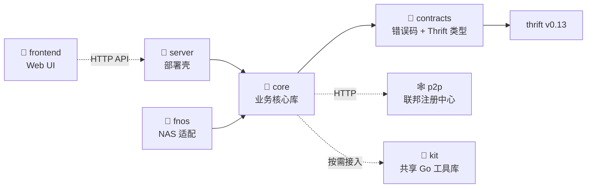

<div align="center">

# 📦 FilesCodeBox · 文件快递柜

**像取快递一样分享文件。** Anonymous passcode sharing for text & files.

一段文本、一个文件，寄件生成口令，对方凭口令取件，到期自动销毁。
无需注册、开源自托管：Docker / Kubernetes / 桌面客户端 / NAS 应用随你部署。

[](https://github.com/filescodebox/filescodebox/blob/main/LICENSE)
[](https://go.dev)
[](https://vuejs.org)
[](https://github.com/filescodebox/filescodebox/releases)

[快速开始](#-快速开始) · [仓库导航](#-仓库导航) · [架构图集](https://github.com/filescodebox/filescodebox/blob/main/docs/architecture.md) · [制品下载](https://github.com/filescodebox/filescodebox/releases)

</div>

## ✨ 特性一览

- 🔑 **匿名口令取件** — 寄件者拿口令、收件者凭码取件，阅后即焚，过期自动清理
- 🗄️ **多存储后端** — OpenDAL 统一抽象：本地磁盘 / S3(MinIO) / 阿里云 OSS / 腾讯云 COS / 华为 OBS / 百度 BOS / WebDAV
- 🧩 **契约先行** — Thrift IDL 单一真相源 + 统一错误码；API 规范由后端运行时生成（`/openapi.json`）
- 🚀 **多种交付形态** — Docker / docker-compose、Kubernetes（Helm Chart）、桌面客户端（Tauri 2 托盘常驻）、飞牛 fnOS 应用包
- 📊 **开箱可观测** — Prometheus `/metrics` 默认开启，OpenTelemetry 链路追踪可选
- 🛡️ **治理内建** — API Token、上传类型/大小/频控、内容审核钩子、管理端站点配置（存库持久化，重启不丢）
- 🕸️ **P2P 联邦 & 设备直传（可选）** — 多节点联邦互认取件；桌面客户端 p2pc 端到端加密直传；MCP 端点供 AI 客户端管理

## 🗂 仓库导航

| 仓库 | 角色 | 最新版本 |
|------|------|----------|
| [**filescodebox**](https://github.com/filescodebox/filescodebox) | 🗂️ 装配仓（umbrella）：`make setup` 一键拉齐全部模块，统一构建/测试/部署 | [](https://github.com/filescodebox/filescodebox/tags) |
| [contracts](https://github.com/filescodebox/contracts) | 📜 契约层：统一错误码 + Thrift 生成类型，纯类型零业务依赖 | [](https://github.com/filescodebox/contracts/tags) |
| [core](https://github.com/filescodebox/core) | 🧠 业务核心库：16 个域服务 + OpenDAL 多后端存储抽象 + `Bootstrap()` 库入口 | [](https://github.com/filescodebox/core/tags) |
| [server](https://github.com/filescodebox/server) | 🚢 独立部署壳：薄壳入口 + Dockerfile，发布多架构镜像 | [](https://github.com/filescodebox/server/tags) |
| [frontend](https://github.com/filescodebox/frontend) | 🎨 Web 前端：Vue3 + TS + Vite + Element Plus | `main` |
| [desktop](https://github.com/filescodebox/desktop) | 🖥️ 桌面客户端：Tauri 2 托盘常驻，三平台安装包 | [](https://github.com/filescodebox/desktop/tags) |
| [fnos](https://github.com/filescodebox/fnos) | 🐂 飞牛 fnOS 应用：fnpack 标准包，数据落 NAS 共享目录 | [](https://github.com/filescodebox/fnos/tags) |
| [p2p](https://github.com/filescodebox/p2p) | 🕸️ P2P 联邦注册中心：节点租约注册 + 口令联邦路由 + 设备直传信令 | [](https://github.com/filescodebox/p2p/tags) |
| [kit](https://github.com/filescodebox/kit) | 🧰 共享 Go 工具库：28 个零生态依赖通用包（retry/syncx/shutdown/workflow 等） | [](https://github.com/filescodebox/kit/tags) |
| [charts](https://github.com/filescodebox/charts) | ☸️ Kubernetes Helm Chart：Pages + OCI 双发布 | [](https://github.com/filescodebox/charts/tags) |

### 依赖方向（单向，CI 强制守护）



📐 生态全景 / core 分层 / 请求流 / 数据流 / 部署形态 / 发布流水线，见 **[架构图集](https://github.com/filescodebox/filescodebox/blob/main/docs/architecture.md)**。

## 🚀 快速开始

**Docker 单容器（最快上手）**

```bash
docker run -d --name filecodebox -p 12345:12345 \
  -e FCB_ADMIN_PASSWORD=change-me \
  -e FCB_JWT_SECRET=$(openssl rand -hex 32) \
  ghcr.io/filescodebox/server:latest
```

**docker compose（前后端分离，推荐自托管形态）**

```bash
git clone https://github.com/filescodebox/filescodebox && cd filescodebox
docker compose up -d                  # API :12345 · 前端 :80（加反代：--profile nginx）
```

**Kubernetes（Helm）**

```bash
helm repo add filescodebox https://filescodebox.github.io/charts && helm repo update
helm install filecodebox filescodebox/filecodebox -n filecodebox --create-namespace
```

**桌面 & NAS**

- 🖥️ 桌面客户端：在 [Releases](https://github.com/filescodebox/filescodebox/releases) 下载 `desktop-v*` 三平台安装包，连接任意 FilesCodeBox 服务器
- 🐂 飞牛 fnOS：下载 `fnos-v*` 应用包（fpk），数据落在你的 NAS 共享目录

> 默认管理员 `admin / admin123`，生产环境务必用 `FCB_ADMIN_PASSWORD` 覆盖。

## 📦 制品出口

| 制品 | 位置 |
|------|------|
| 🐋 容器镜像（多架构） | `ghcr.io/filescodebox/server` · `ghcr.io/filescodebox/frontend` · `ghcr.io/filescodebox/fnos` |
| 📥 桌面安装包 / fnOS 应用包 | 统一回挂 [hub Releases](https://github.com/filescodebox/filescodebox/releases) |
| ☸️ Helm Chart | [Pages 仓库](https://filescodebox.github.io/charts/) + `oci://ghcr.io/filescodebox/charts/filecodebox` |

## 🤝 参与贡献

- 入口仓库 clone 后 `make setup && make test` 即可开始开发，见 [CONTRIBUTING.md](https://github.com/filescodebox/filescodebox/blob/main/CONTRIBUTING.md)
- 安全漏洞请走 [SECURITY.md](https://github.com/filescodebox/filescodebox/blob/main/SECURITY.md) 披露流程，勿直接开 issue

## 📄 许可证

全生态以 **Apache-2.0** 发布。概念灵感来自 [vastsa/FileCodeBox](https://github.com/vastsa/FileCodeBox)（LGPL-3.0），本生态为 Go 独立实现，无源码衍生关系。
